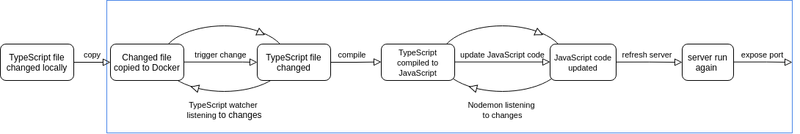

# Node-TypeScript-Docker Template

🐳 Template for a simple TypeScript-Node-Docker service with hot reloading.

Intentionally minimalistic, without any framework or additional libraries.

<br />

## Usage

1. Use/Pull/Fork this template
2. Navigate to the folder
3. Run `docker-compose up`

> Depending on your machine, you might experience a "ts-node" error after a fresh build. Doing step #3 once again solves the issue.

<br />

## Hot Reloading Explained

> Removing `volumes` section from the `docker-compose.yml` file malfunctions hot reloading.

### Files

Automatic (hot) reloading is triggered when a `.ts` file is changed locally. The exact flow is visualized below.



### Packages

Adding packages to the running container does not trigger hot reloading. When adding a new package by using `yarn add`, do the following steps instead:

1. Stop and remove the existing container
`docker-compose stop ts-service && docker-compose rm -f ts-service`

> In case you changed the service name in the docker-compose.yml file, replace "ts-service" with the changed name

2. Run `docker-compose build ts-service`. This will install the newly added package too
3. Run `docker-compose up ts-service`

Or in one line:

```Bash
docker-compose stop ts-service && docker-compose rm -f ts-service && docker-compose build ts-service && docker-compose up ts-service
```

<br />

## Production Deploy

### container's content

The built container in production will only contain files/folders not ignored
by the `.dockerignore` file (wanted behaviour).

<br />

### docker-compose.yml

The `docker-compose.yml` file and `docker-compose` commands should not be used in production. This file's purpose is to ease the local development, including adding the hot reloading ability.

<br />

### command

When deploying the service to production, set `yarn start` as the container's "command".

Examples:

- In AWS ECS: Container Definitions -> command
- In GCP Cloud Run: Container command

<br />

Alternative:

1. Remove `command: yarn dev` line from `docker-compose.yml` and set `NODE_ENV` environment variable (line #9)

```yaml
        ...
        environment:
            NODE_ENV: "development"
```

2. Add this line to the very end of the `Dockerfile` (line #6)

```Docker
CMD yarn "$(if [ $NODE_ENV = 'production' ] ; then echo 'start' ; else echo 'dev'; fi)"
```

3. When deploying to production, set `NODE_ENV` environment variable to `production`

> When choosing the alternative, it is **no longer** needed to set "command" in your cloud provider. Setting `CMD` in the Dockerfile (step #2) does the job for you

<br />

## Errors

When you encounter an error (or unexpected behaviour) that you cannot solve:

1. Remove the Docker container, image, and valumes

2. Then run `docker-compose build --no-cache ts-service`

3. Lastly, run `docker-compose up ts-service`

In case this does not fix the error, or if you have any additional questions, feel free to open a GitHub issue
